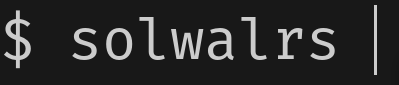

[](https://github.com/TheAwiteb#donating)

<div align="center">
    
    <h1>Solwalrs</h1>
    A simple and easy to use CLI Solana wallet<br>

<a href="https://www.gnu.org/licenses/">
  
</a>
<a href="https://rust-lang.org/">
  
</a>
<br>
<a href="https://crates.io/crates/solwalrs">
    
  </a>
<br>
<a href="https://github.com/TheAwiteb/solwalrs/actions/workflows/ci.yml">
  
</a>
<br>
<a href="https://github.com/TheAwiteb/solwalrs/actions/workflows/release.yml">
  
</a>

</div>


## Requirements
- Cargo 1.62.0 or higher (https://doc.rust-lang.org/cargo/getting-started/installation.html)
- OpenSSL (https://www.openssl.org/source/)

## Installation
### Using cargo
You can install solwalrs using cargo (recommended):
```bash
cargo install solwalrs
```
After installing, you can run solwalrs using `solwalrs` command. If you get an error, make sure that your `PATH` environment variable contains the directory where cargo installs binaries. You can find the binary directory here:
`$HOME/.cargo/bin`
### Building from source
```bash
git clone https://github.com/TheAwiteb/solwalrs.git
cd solwalrs
cargo build --release
```
After building, the binary will be located at `target/release/solwalrs`, you can copy it to your `PATH` or run it directly from the `target/release` directory.


## Usage
```bash
A simple and easy to use CLI Solana wallet

Usage: solwalrs [OPTIONS] [COMMAND]

Commands:
  keypair      Commands for managing a keypair [aliases: kp]
  new          Generate a new keypair [aliases: n]
  list         List all keypairs [aliases: ls]
  import       Import new keypair by private key or secret key (input prompt) [aliases: i]
  completions  Generate shell completions [aliases: cp]
  clean        Clean the wallet. This will remove all the keypairs from the wallet
  price        Get the price of a token/SOL in USDT [aliases: p]
  help         Print this message or the help of the given subcommand(s)

Options:
      --app-file <APP_FILE>  The path to the app file
  -v, --verbose              Verbose mode, for debugging
      --rpc <RPC>            RPC URL, default is `https://api.mainnet-beta.solana.com` [default: https://api.mainnet-beta.solana.com]
  -h, --help                 Print help information (use `--help` for more detail)
  -V, --version              Print version information
```
> Use `solwalrs help <command>` to get more information about a command. For example, `solwalrs help keypair`

## Auto completion
You can enable auto completion for bash, fish, powershell and zsh.<br>
For Bash, move `solwalrs.bash` to `$XDG_CONFIG_HOME/bash_completion` or
`/etc/bash_completion.d/`.<br>
For Fish, move `solwalrs.fish` to `$HOME/.config/fish/completions/`.<br>
For the Z shell, move `_solwalrs` to one of your `$fpath` directories.<br>
For PowerShell, add `. _solwalrs.ps1` to your PowerShell
[profile](https://technet.microsoft.com/en-us/library/bb613488(v=vs.85).aspx)
(note the leading period). If the `_solwalrs.ps1` file is not on your `PATH`, do
`. /path/to/_solwalrs.ps1` instead.<br>
To generate Solwalrs completions, run `solwalrs completions > <the-name-above-as-your-shell>`.<br>

## Features
- Supports multiple keypairs
- Possibility to mark some keypair as default keypair
- Create a new keypair
- View your keypairs
- Delete your keypair
- Import a keypair from a private key and secret key (base58 encoded or array of bytes)
- Qr code generator for your public key, export to image or print to console
- Clean the app file (remove all keypairs)
- Auto completion for bash, elvish, fish, powershell and zsh
- Supports changing the RPC URL
- Supports SPL tokens
- View your SOL/SPL balance
- Airdrop SOL
- Get the price of SPL/SOL

## Adding a new SPL token
Please open an issue and I will add it to the next release. You can also add it yourself by following these steps:
1. Open the `src/wallet/spl.rs` file
2. Add the SPL to `Tokens` enum
3. Add the mint address to `mint_address` instance function
4. Add the lamports per token to `lamports_per_token` instance function (if it's not 6 decimals)
5. Open a pull request, I will review it and merge it
>  Note the SPL token must be popular to be added to the wallet

## Our goals (roadmap)
You can see our goals in this issue: [#1](https://github.com/TheAwiteb/solwalrs/issues/1)

## Safety
Solwalrs stores your private key in a file called `solwalrs.json`[1]. This file is encrypted using Fernet (symmetric encryption) by [fernet](https://crates.io/crates/fernet) crate. The encryption key is derived from a password that you provide. The password is never stored anywhere. If you lose your password, you will lose access to your wallet. Use a password manager to generate a strong password and store it somewhere safe.

[1] The file path will printed to the console when you create a new keypair, you can change the file path by setting the `--app-file` flag. For example, `solwalrs --app-file /path/to/file keypair new testwalletname`

## Security
If you discover a security vulnerability within this project, please send me an email at [Awiteb@hotmail.com](mailto:awiteb@hotmail.com) or through the telegram [@TheAwiteb](https://t.me/TheAwiteb). All security vulnerabilities will be promptly addressed.

## Images
<!-- Table contain the images -->
| Create a new keypair | View your keypairs |
|:---:|:---:|
|  | 
| Qr code image | Qr code console |
|  | 

## Tested on
- Pop!_OS 21.04
- Android Termux (arm64)

## License
<div align="center">
  <a href="https://www.gnu.org/licenses/gpl-3.0.en.html">
      
  </a>

This project is licensed under the terms of the GNU General Public License v3.0. See <https://www.gnu.org/licenses/gpl-3.0.html> for more details.
</div>

## Contributors
<div align="center">
Thanks for all the contributors who helped make this project better!<br>

<a href="https://github.com/TheAwiteb/solwalrs/graphs/contributors">
  
</a>
</div>
